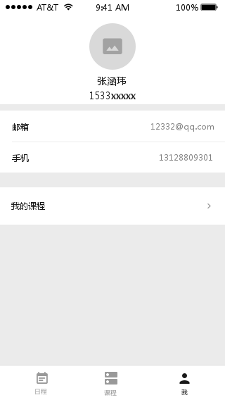

# MyTA

现如今的大学教学中，Teaching Assistant是教师与学生交流不可或缺的一部分，其作用主要在作业布置，作业收发，作业统分，作业讲解，课程相关公告发布，甚至有的TA须协助完成课堂签到；但是实际中TA对老师的协助效率较低，往往是在线上通过QQ的方式联系学生。当前的教师-TA教学体系存在如下问题：

- TA与同学的交流、向同学们解答问题的机会少
- 往往大多数与TA的联系都是不私戳的，因此和作业相关的解答只有部分人知道
- 传统的纸质签到效率低，且浪费纸张
- 传统纸质作业收发存在时间不统一，作业本不统一的问题，加大了ta的工作难度
- 讲解题目的方式主要是用一节课时间解答几周甚至几个月积累的题目，难以保障同学们的积极性和参与度，而且由于时间有限大多数情况下只能讲解部分题目
- QQ群大多数是无用信息，不适合作业的公布，课程通知的发布等教学活动
- ...

MyTA是一款教学、学习辅助手机应用软件，旨在尽可能地解决上述问题，提高教师-TA-学生之间的信息交换效率。

## 功能

### 教师（TA）端

1. 创建课程
2. 布置作业
3. 设置临时签到
4. 管理问答版块
5. 成绩发布
6. 统计信息

### 学生端

1. 添加课程
2. 提交作业
3. 签到
4. 查询成绩
5. 问答版块

## 分工

| 成员   | 任务                                       |
| ---- | ---------------------------------------- |
| 詹宗沅  | 1. 参照设计图设计课程查看界面 2. 实现存储课程数据的Course类，要在models文件夹下实现  |
| 张家侨  | 1. 参照设计图设计学生详情界面 2. model文件夹下实现储存用户信息的User类  |
| 刘俊君  | 1. 按照设计图布置界面 2. 在model文件夹下实现类Assignment类  |
| 张涵玮  | 1. 设计后台服务器提供相关接口 2. 设计后端数据库           |
